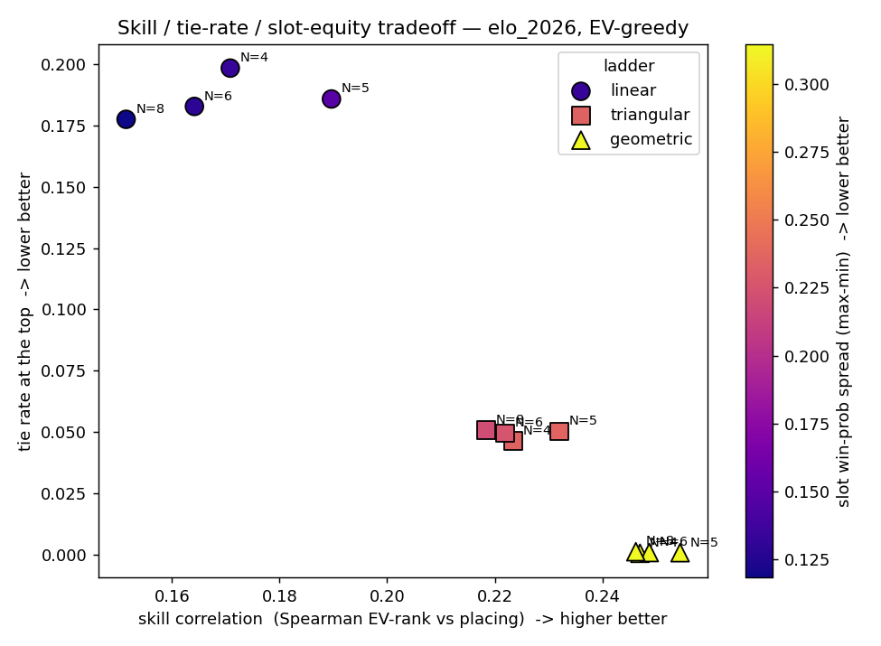
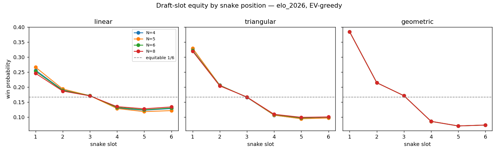
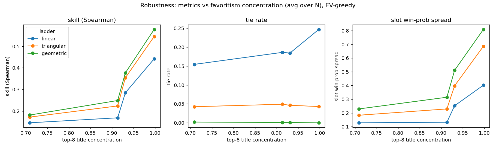

# How to run a fair, fun 2026 World Cup draft pool — a plain-English guide

*A report for organisers, no maths required. 2026-06-08.*

---

## The bottom line (read this if you read nothing else)

You and five friends are going to **draft** (pick) World Cup teams and score points as
your teams advance. Two questions decide whether the pool is fun and fair:

1. **How many teams should each person get?** → **It barely matters — it's your choice.**
   The number of teams does not change who tends to win. We *suggest* **8 each**, because
   with 6 players that uses all 48 teams, so everyone fields a full squad and the eventual
   champion is always on someone's roster. But 4, 5, or 6 each are just as competitive —
   pick whatever suits your group.

2. **How many points for reaching each round?** → Use the **"Building" system:
   1, 3, 6, 10, 15, 21** points for reaching the Round of 32, Round of 16, Quarter-final,
   Semi-final, Final, and winning it.

This combination keeps the contest **mostly fair between draft positions**, makes **ties
very rare**, and still **rewards the person who drafts well** — without turning the whole
pool into a coin-flip on "who got the champion." We reached this answer by simulating the
World Cup **50,000 times** on a computer and measuring what happens under different rules.

---

## 1. What is a "draft pool"?

A draft pool is a friendly competition built on a real tournament. Here is the version this
report studies:

- **6 people** take part.
- They take turns **picking** (drafting) national teams, one at a time, until each person
  has a set of teams.
- As the World Cup plays out, you **earn points** when *your* teams advance to later rounds.
- When the tournament ends, **whoever has the most points wins** the pool.

The organiser has to choose two things before starting: **how many teams each person
drafts**, and **how many points each round is worth**. Those two choices are exactly what
this report tests. It turns out they matter a lot — and picking them by gut feel can quietly
ruin the pool (see §9).

---

## 2. A plain-English glossary

You do **not** need any of these terms to read the report — they are defined here just in
case. Each comes with an everyday analogy.

| Term | What it means | Everyday analogy |
|---|---|---|
| **Draft** | Taking turns picking teams. | Picking players for a playground team. |
| **Snake order** | The pick order reverses each round: 1-2-3-4-5-6, then 6-5-4-3-2-1, and so on. | Dealing cards back-and-forth so no one is always last. |
| **Scoring ladder** | The list of points for reaching each round. | A pay scale: the further you get, the more you earn. |
| **Skill vs luck** | How much the *better* drafter tends to win, versus random chance. | A game of chess (skill) vs a raffle (luck). Most pools are somewhere in between. |
| **Tie** | Two or more people finish with the same top score. | Two runners crossing the line together — now what? |
| **Seat (slot) fairness** | Whether your *pick position* (1st to draft, 2nd, …) changes your chance of winning. | Whether sitting at the head of the table gives you an edge. |
| **Champion dominance** | How often the person who drafted the eventual World Cup winner also wins the pool. | "Whoever owns the winning horse takes the whole pot." |
| **Simulation** | Playing the whole tournament on a computer using realistic chances, over and over. | Rolling weighted dice thousands of times to see what usually happens. |
| **Team rating (Elo)** | A single number for how strong a team is, like a chess rating. Bigger gap = bigger favourite. | A boxer's ranking: a higher-ranked fighter usually (not always) wins. |
| **Margin of error** | The natural wobble in a simulated number from re-running it. If two numbers differ by less than this wobble, we treat them as a tie, not a real difference. | A bathroom scale that reads ±0.2 kg: 70.0 and 70.1 are "the same." |
| **"Chalk"** | When the favourites simply win and there are no surprises. A "chalky" pool is always won by whoever grabbed the top teams. | Betting on every favourite and nothing else. |

---

## 3. How we tested the rules (the "calculations," in plain words)

We never guessed. We **measured**, using a computer model. Here is the whole idea in four
plain steps.

**Step 1 — Give every team a strength number.** Each of the 48 teams gets a rating (like a
chess rating). We used real, published strength ratings for the 2026 field (Spain, Argentina
and France are the strongest; the smallest qualifiers are well below them). A bigger rating
gap means a bigger favourite in a match.

**Step 2 — Play one whole World Cup on the computer.** The model plays all 104 matches.
Stronger teams win *more often*, but not always — upsets happen, just like real life. The
group stage, the "8 best third-placed teams" rule, and the entire knockout bracket are all
built in exactly as FIFA has set them for 2026.

**Step 3 — Do it 50,000 times.** One simulated tournament is just one story. To learn what
*usually* happens, we replay the tournament **50,000 times** for every set of rules. This is
called a *simulation*. (Think of flipping a coin once versus flipping it 50,000 times to
confirm it's really 50-50.)

**Step 4 — Run the draft and add up points.** For each rule set, the computer drafts teams
for the 6 players and adds up everyone's points in every one of the 50,000 tournaments. Then
we ask four simple questions (next section).

**A tiny scoring example.** Suppose you used the "Building" ladder, 1-3-6-10-15-21 (one of
the three point systems we compare in §4, and the one we end up recommending). If one of
your teams gets knocked out in the quarter-final, that team earns you **6 points**. If
another of your teams goes all the way and wins the World Cup, it earns you **21 points**.
Your score is just the sum across all your teams.

---

## 4. The three scoring systems we compared

We compared three sensible "points per round" ladders. Every one gives **0 points** for a
team that doesn't get out of the group stage.

| Reach this round → | R32 | R16 | Quarter | Semi | Final | **Champion** | In words |
|---|---|---|---|---|---|---|---|
| **Steady** (linear) | 1 | 2 | 3 | 4 | 5 | **6** | Each round is worth one more point. |
| **Building** (triangular) | 1 | 3 | 6 | 10 | 15 | **21** | Each round is worth a bit more than the last. |
| **Doubling** (geometric) | 1 | 2 | 4 | 8 | 16 | **32** | Each round doubles — the late rounds dominate. |

The difference is **how much the late rounds matter**. "Steady" treats a champion as only
6× a first-round team. "Doubling" treats a champion as **32×** a first-round team — so under
Doubling, the whole pool is really about who drafted the eventual winner.

---

## 5. The four questions we asked of each rule set

1. **Does skill matter, or is it just luck?** Did the people who drafted the strongest teams
   actually tend to finish higher? (Higher = more of a skill contest.)
2. **How often does the pool end in a tie at the top?** (Ties are annoying — they need a
   tiebreaker rule.)
3. **Is every draft seat fair?** Does drafting 1st give you a much better shot than drafting
   6th? (We want everyone's seat to be close to an equal 1-in-6 chance — that's **16.7%**.)
4. **Does the pool just become "whoever got the champion"?** If owning the eventual winner
   almost guarantees the pool, the other picks barely matter.

---

## 6. The results

### 6a. The big picture: the unavoidable trade-off

**How to read this chart.** Each marker is one rule set. Right = more skill (good). Down =
fewer ties (good). The marker **colour** shows seat fairness: dark/purple = fair seats
(good), bright/yellow = unfair seats (bad). The three shapes are the three scoring systems.

The picture tells one clear story: **the three goals pull against each other.** As you move
toward more skill and fewer ties (down-right, the Doubling system), the markers turn yellow —
meaning seats get *less* fair. You cannot max out all three at once.

*(In words, ignoring colour: the markers that are best for skill and ties — bottom-right —
are exactly the ones that are worst for seat fairness. That's the trade-off in a nutshell.)*

### 6b. The numbers, in plain terms

For the real 2026 field, here is what each system delivers (averaged over the simulations):

| | **Steady** (1-2-3-4-5-6) | **Building** (1-3-6-10-15-21) | **Doubling** (1-2-4-8-16-32) |
|---|---|---|---|
| **Does the better drafter tend to finish higher?** (0 = no better than chance, 1 = always) | 0.17 (weak) | 0.22 (modest) | 0.25 (strongest) |
| **Share of the result the draft actually explains** (the rest is luck) | ~4% | ~7% | ~9% |
| **How often a tie at the top?** | **19%** (very common) | 5% | **0.1%** (almost never) |
| **1st-seat win chance** (fair share = 16.7%) | 26% | 33% | **38%** |
| **Last-seats win chance** (5th/6th; fair share = 16.7%) | 12–13% | 10% | **7%** |
| **"Champion's owner wins the pool"** | 51% | 77% | **99.9%** |

Two things to notice. First, the top two rows say the same thing two ways: **the draft is a
weak lever** — even under Doubling, who you drafted explains only about **9%** of who wins
the pool; the other ~90% is luck. (That first "0-to-1" row is just *how often the better
drafter finishes higher*, not a percentage — see the glossary note on skill vs luck.)
Second, the steeper the scoring, the more lop-sided the bottom rows get: under **Doubling**
the person who drafts first wins **38%** of the time — more than double their fair 1-in-6
share — the last seats win only **7%**, and whoever owns the champion wins **99.9%** of the
time, so every other pick is almost irrelevant. **Building** softens all of this while
keeping ties rare.

### 6c. Is the first seat really favoured? Yes — and worse with steeper scoring

Each line shows the chance of winning the pool by **draft seat** (1 = picks first … 6 =
picks last). The grey dashed line is the fair 1-in-6 (16.7%). Under every system the first
seat is favoured, but the **Doubling** system (right panel) is the most lop-sided: the first
seat sits near **38%** while the later seats sag to about **7%**. (Because the draft order
"snakes" back and forth, the very last seat actually recovers a touch — the toughest seat is
around the 5th — but either way the late seats are well below the early ones.) **Building**
(middle) is gentler; **Steady** (left) is the flattest, i.e. fairest — but, as we saw,
Steady pays for that fairness with frequent ties.

### 6d. Does the answer hold up if the favourites are stronger or weaker?

A fair question: *"What if the top teams are even more dominant than we assumed, or more
evenly matched?"* We re-ran everything across a range — from a fairly even field to one
where a handful of teams tower over the rest (left to right on each panel).

The **order never changes**: Doubling always gives the most skill and the fewest ties;
Steady always gives the fairest seats. The one thing that *grows* with a top-heavy field is
**seat unfairness** (right panel shoots up). In other words, the more lopsided the real
field is, the worse the first-seat advantage becomes — and the 2026 field *is* top-heavy.
That's exactly why we don't recommend the steepest (Doubling) system.

### 6e. One reassuring result: you can't easily "game" the draft

We also tested a "shark" player who tries to out-smart everyone by drafting cleverly instead
of just taking the best team available. **It didn't help** — the shark did no better than a
straightforward "best team available" approach. So nobody needs to be a strategy expert;
honest, simple drafting is fine. (This held under every scoring system.)

---

## 7. What it all means (the one key insight)

There is a single dial behind everything: **how steep the scoring is.**

- **Steeper scoring (Doubling)** makes the late rounds — especially the champion — worth so
  much that (a) the better drafter wins more often, and (b) ties almost vanish. *But* it also
  means **drafting first** (and grabbing the top favourite) becomes a big advantage, and the
  pool turns into "did you get the champion?"
- **Flatter scoring (Steady)** spreads the value out, so **seats are fairer** — *but* scores
  bunch up, producing **frequent ties**, and the contest leans more on luck.

A crucial, honest point for everyone's expectations: **a 6-person World Cup pool is
mostly luck no matter what you choose.** Even with the most skill-rewarding scoring, *how
well you drafted explains under 10% of who wins* — the other 90%-plus is the luck of which
teams happen to go far. The scoring choice nudges that balance; it does not turn the pool
into a real test of skill. (So treat it as a fun game, not a contest of expertise.)
And **how many teams each person drafts barely matters at all** for competitiveness — the
differences between 4, 5, 6, and 8 teams were too small to be real (within the margin of
error). So choose the number of teams for convenience, and spend your attention on the
scoring ladder, which *does* matter.

---

## 8. How other people run their pools (and how this compares)

Draft and bracket pools are everywhere; the choices below are well documented. Our findings
line up with — and sharpen — what these communities have learned.

- **March Madness bracket pools (basketball).** About **81% of pools use a fixed
  "points-per-round" system**, and the most common single ladder is exactly the
  **1-2-4-8-16-32** "Doubling" system we tested (used by roughly **70%** of pools)
  ([TeamRankings](https://www.teamrankings.com/blog/ncaa-tournament/bracket-pool-scoring)).
  Many pools deliberately pick a *gentler* ladder to avoid the "it's all about the champion"
  problem — for example a **Fibonacci** ladder, 2-3-5-8-13-21
  ([TeamRankings](https://www.teamrankings.com/blog/ncaa-tournament/bracket-pool-scoring)),
  or **1-3-6-10-15-20**, which is essentially identical to our recommended "Building" ladder
  ([PrintYourBrackets](https://www.printyourbrackets.com/bracket-scoring.html)). Others add
  **upset bonuses** (extra points for correctly backing a lower-seeded underdog). Our result
  explains *why* experienced communities drift toward these gentler ladders: the pure
  Doubling ladder concentrates almost everything on a single pick.
- **World Cup office "sweepstakes."** The classic office version draws team names **from a
  hat at random** — pure luck, no drafting and no skill at all
  ([FourFourTwo](https://www.fourfourtwo.com/competition/world-cup-2026-sweepstakes-kit-download-and-print-our-sweepstake-template)).
  Fun and effortless, but the opposite of a skill contest.
- **"Pick'em" and "progressive pick'em" pools.** Instead of drafting teams, players predict
  match results; "progressive" versions pay more for later rounds. The basic version adds one
  point per round (1, 2, 3, … — like our "Steady" ladder), while "extreme" versions double
  each round (1, 2, 4, … — like our "Doubling" ladder)
  ([PoolTracker](https://www.pooltracker.com/game_info/world-cup.asp);
  [OfficePools](https://www2.officepools.com/fantasy-soccer/)).
- **Auction / "Calcutta" pools.** Instead of taking turns, players **bid money** for teams;
  any player can win any team if they pay enough. This is the standard fix in fantasy sports
  for the unfair-seat problem we measured — because nobody is stuck "drafting last," seat
  position stops mattering. The trade-off is that it's more complicated to run and needs a
  budget. (If perfectly equal seats matter most to your group, an auction is worth
  considering instead of a snake draft.)

---

## 9. Why "just making up the points" is risky (the cons of arbitrary scoring)

It's tempting to scribble down any point values that "feel right." Our simulations show what
can quietly go wrong when scoring is chosen arbitrarily rather than tested:

1. **You can accidentally create a tie-fest.** Flat, small numbers (like 1-2-3-4-5-6) cause
   scores to collide: in our tests the top of the table was a **tie 19% of the time** — about
   one pool in five ends in a draw and needs an awkward tiebreaker.
2. **You can accidentally rig it for the first pick.** Steep numbers (like 1-2-4-8-16-32)
   hand the first drafter a **38%** win chance — more than double everyone else's fair share
   — purely because of pick order, not skill.
3. **You can accidentally make the whole pool a single coin-flip.** Under steep scoring, the
   champion's owner wins **99.9%** of the time, so essentially **every pick except the one
   eventual champion stops mattering**. One lucky pick decides everything.
4. **You can accidentally make it all luck — or all favourites.** Get the steepness wrong
   and the pool is either decided by a single random result, or simply always won by whoever
   grabbed the top teams (no surprises, no real contest). Neither is fun.
5. **What "feels balanced" depends on the teams.** The same point system behaves *differently*
   depending on how lopsided the field is (§6d). The 2026 field is top-heavy, which makes
   steep scoring more unfair than it would be in an even field — something you'd never notice
   without testing.

The fix is simple: don't guess. Use a ladder that has been checked against all four
questions — which is what the recommendation below is.

---

## 10. Recommendations

### How many teams should each participant draft?

**Use 8 teams each.** With 6 players that uses all 48 teams, so:

- everyone fields a **full squad of 8**,
- **every team is owned** by someone (more teams to root for), and
- the eventual champion is **always on somebody's roster**.

**Important:** the number of teams barely affects who wins — **4, 5, or 6 each are just as
competitive** (the differences were within the margin of error). So if a smaller, lighter
pool is more your speed, any of those is fine. Choose the number for **convenience and fun**,
not competitiveness.

### What should the scoring system be?

**Use the "Building" ladder: 1, 3, 6, 10, 15, 21** (points for reaching the Round of 32,
Round of 16, Quarter-final, Semi-final, Final, and for winning). It is the **balanced
choice**: it keeps most of the skill of steep scoring, makes ties rare (about 1 in 20), and
avoids the worst of the first-seat advantage and the "all about the champion" problem.

Pick a different ladder **only** if your group has a strong, specific preference:

| If your group most wants… | Use… | …and accept this cost |
|---|---|---|
| **A balanced, all-round pool** (recommended) | **Building: 1, 3, 6, 10, 15, 21** | Mild first-seat edge; ~5% tie rate. |
| **A pure skill contest, almost no ties** | Doubling: 1, 2, 4, 8, 16, 32 | Big first-seat edge; pool ≈ "who got the champion." |
| **The fairest possible draft seats** | Steady: 1, 2, 3, 4, 5, 6 | Frequent ties (~19%) — you'll need a clear tiebreaker. |

**Two small extras that help any pool:**
- Decide a **tiebreaker in advance** (e.g., most teams reaching the Final, then a coin flip)
  — especially important if you choose the flatter "Steady" ladder.
- If **perfectly equal seats** matter more to your group than simplicity, consider an
  **auction** instead of a snake draft (see §8): letting everyone bid removes the
  pick-order advantage entirely.

---

## 11. Things to keep in mind (honest caveats) — *optional reading*

This is a model, and models simplify reality. None of these change the recommendation, but
you should know them:

- We treated all matches as played at a **neutral venue**. (The 2026 hosts — USA, Canada,
  Mexico — would get a small real-world home boost we didn't apply.)
- For a handful of the **lowest-ranked qualifiers**, exact strength ratings weren't published,
  so we used reasonable estimates. The conclusions rest on the overall *spread* of strength,
  which these estimates don't change.
- **Penalty shootouts** are modelled simply (the stronger team is a bit more likely to
  advance). Real shootouts are closer to a coin flip, so the model may slightly over-favour
  the stronger team in knockout ties.
- The exact bracket pairing of the "8 best third-placed teams" follows FIFA's rules closely
  but uses one valid arrangement; this doesn't affect the overall results.

---

## 12. Where these numbers come from — *optional reading*

- **The full technical method, every assumption, and the data sources** are documented in
  the project's [assumptions file](assumptions.md) and the
  [audit trail](audits/audit_trail_2026-06-08_wcpool.md). The headline numbers in this report
  come from the simulation results in
  [results_main_2026-06-08.csv](tables/results_main_2026-06-08.csv) (the per-seat, tie, and
  champion figures), [results_summary_2026-06-08.csv](tables/results_summary_2026-06-08.csv),
  and the [recommendation](tables/recommendation_2026-06-08.md).
- **Team strengths:** World Football Elo ratings (a chess-style rating system for national
  teams), snapshot dated 2026-06-01.
- **Tournament format:** the official FIFA 2026 structure (48 teams, 12 groups, the 8
  best third-placed teams, and the published knockout bracket).
- **Other pool systems referenced** in §8:
  [TeamRankings](https://www.teamrankings.com/blog/ncaa-tournament/bracket-pool-scoring),
  [PrintYourBrackets](https://www.printyourbrackets.com/bracket-scoring.html),
  [FourFourTwo](https://www.fourfourtwo.com/competition/world-cup-2026-sweepstakes-kit-download-and-print-our-sweepstake-template),
  [PoolTracker](https://www.pooltracker.com/game_info/world-cup.asp),
  [OfficePools](https://www2.officepools.com/fantasy-soccer/).

*Prepared with computer simulation and reviewed under a multi-check quality-control process
(see the audit trail). This is a modelling study for a recreational pool, not betting advice.*
