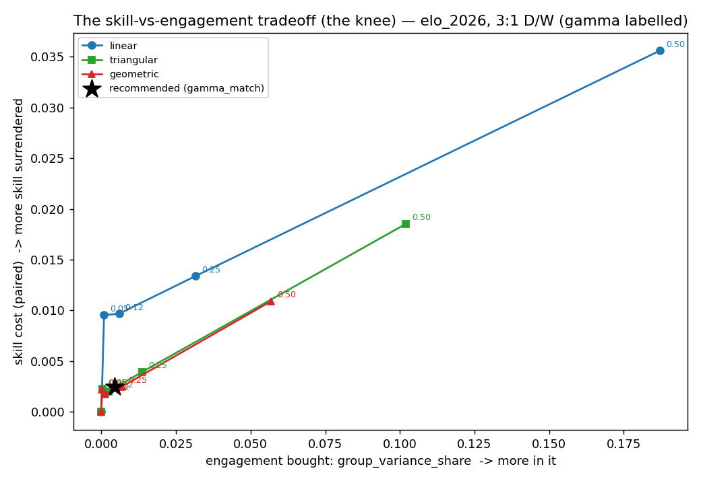
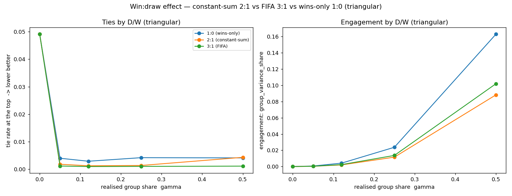
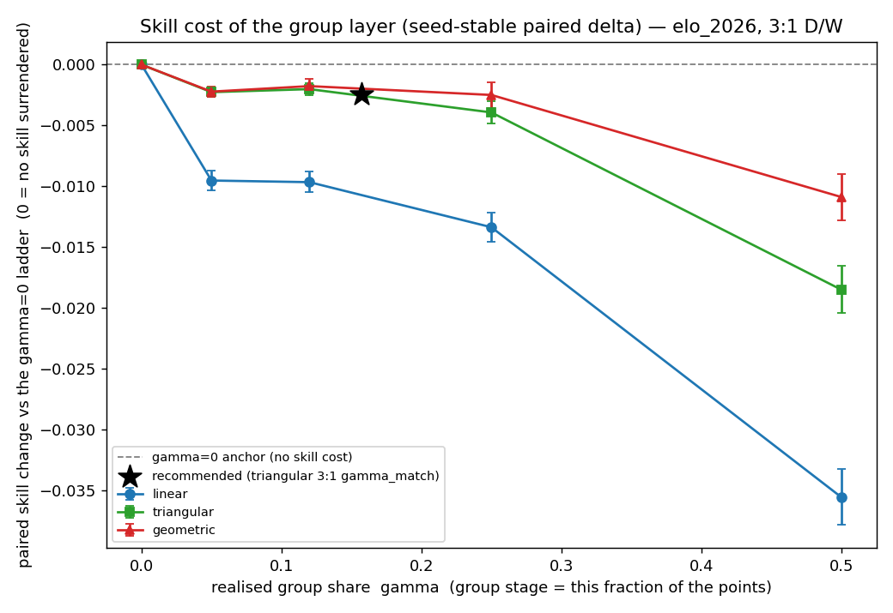
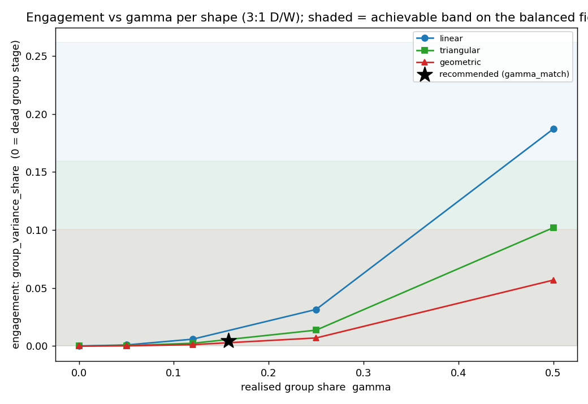
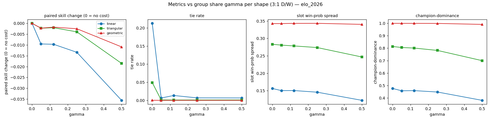

# Knights' FIFA 2026 Draft — adding the group stage

## The bottom line

The prior version of this pool gave **zero points for the entire group stage** — every player
sat on 0 until the Round of 32 (that's 48 of the 104 matches, nearly half the tournament, with
nothing on the line for the pool). This update fixes that by **scoring group-stage results**,
so everyone is in it from the first kickoff — at a small, measured cost to how much drafting
skill shows through.

**The recommended scoring:**

1. **Group stage: 3 points for a win, 1 for a draw** (the same numbers you see on the
   on-screen group table; no points for goals or losses).
2. **Knockout rounds — bank points for each round your team survives:**
   **9, 18, 27, 36, 45, 54** for reaching the Round of 32, Round of 16, Quarter-final,
   Semi-final, Final, and winning the Cup.

Equivalently, as a **total-for-reaching-each-round** table:

| Reach → | R32 | R16 | QF | SF | Final | Champion |
|---|---|---|---|---|---|---|
| Points (total) | 9 | 27 | 54 | 90 | 135 | **189** |

The two are the same thing: banking 9, then 18, then 27, … adds up to 9, 27, 54, 90, 135, 189.

Your score each tournament is the sum across your six teams of their group points (3 per win,
1 per draw) plus whatever knockout points they bank.

This keeps the drafting skill almost exactly where it was, makes ties **rarer** (not more
common), and gives every player a live, moving score throughout the group phase. Basis: the
tournament simulated 200,000 times under each rule set.

## 1. What changed and why

In the old pool the group stage was dead: nobody scored, nobody could lead or fall behind, and
the whole pool was effectively a bet on **who drafted the eventual champion**. That's fun for the
knockouts but leaves the first two weeks flat.

The fix is to award pool points for **group-stage wins and draws**. The catch — and we measured
it precisely — is that three group games per team is a small, noisy, weakly-skill-related sample,
so leaning on it *too* hard would dilute how much the *better drafter* tends to win. The whole
design question is: **how much group-stage scoring buys real early engagement without giving up
meaningful drafting skill?** We answer it with a single dial and pick the sweet spot.

## 2. The dial: how big is the group stage?

We measure the group stage's weight by **γ (gamma)** — the share of all the points on the board
that the group stage is worth. γ = 0 is the old pool (group stage worth nothing). The bigger γ,
the more the group phase matters relative to the knockouts.

The recommended setting is **γ ≈ 0.16**, the natural landmark where **winning all three group
games is worth exactly the same as reaching the Round of 32** (3 wins × 3 points = 9 = the R32
bank). That's an honest, self-explaining balance point: a perfect group stage equals one knockout
round of progress. It also happens to sit in the efficient zone — past it, you start paying real
skill for extra group weight; before it, you're leaving early engagement on the table.

## 3. What it costs, and what it buys

Each curve is a scoring shape; moving right along it means a bigger group stage (higher γ). Up =
more drafting skill given up. The recommended point (the star) sits low-left: lots of the
engagement is bought for almost no skill cost, before the curve turns steeply upward near γ = 0.5.

Here is the recommended setting against the old (group-stage-dead) pool, on the real 2026 field:

| | Old pool (γ = 0) | Recommended (γ ≈ 0.16) |
|---|---|---|
| Better drafter finishes higher? (0 = chance, 1 = always) | 0.283 | 0.281 |
| Tie at the top | 4.9% | **0.5%** |
| Pool is "all about the champion" (champion's owner wins) | 81% | 80% |
| Group stage's share of who ultimately wins | **0% (dead)** | <0.5% (small, deliberate) |
| Everyone still mathematically alive into the knockouts | yes | yes |

Both columns are from the **same** 200,000-tournament run on the real 2026 field, and the tie
figure for the recommended column is measured on the **actual integer scoring we ship** (3/1 group
points plus the 9-27-54-90-135-189 knockout ladder), not an idealised version of it.

- **Skill barely moves** — from 0.283 to 0.281. That drop (0.0025) is about **0.6×** the
  run-to-run noise in this number, i.e. statistically indistinguishable from zero. The group
  layer is, for skill purposes, **practically free**.
- **Ties get rarer, not more common** — 4.9% → 0.5%. Adding lots of small, varied group-point
  totals gives many more distinct possible final scores, so exact ties at the top become much less
  likely. (0.5% is the measured rate for the whole-number scoring we actually use; you still want a
  tiebreaker on the books — see §6.)
- **Every player has a live, moving score from match one.** In the old pool nobody moved off 0
  until the Round of 32; now a fast group start shows up immediately on the leaderboard. By design
  the group stage decides only **a small, deliberately near-zero share (<0.5%) of who ultimately
  wins** — we keep it that small so drafting skill is preserved — but the leaderboard is alive
  throughout the group phase instead of frozen at 0.

### How much should the group stage matter? (you can dial it up)

γ ≈ 0.16 is the **recommended default** because it is self-explaining (a perfect group stage = one
knockout round) and barely touches drafting skill. But it is not the only good choice — if you want
the group stage to carry visibly more of the standings, you can move the dial up at a still-small,
honestly-stated cost. Here are the three settings worth considering, on the real 2026 field:

| Setting | How much the group stage drives the standings | Skill cost (vs the dead-group pool) | Pool still "about the champion"? |
|---|---|---|---|
| **γ ≈ 0.16 (recommended)** | small (about 0.4% of final-score swing) | ~0.6× the run-to-run noise — undetectable | 80% |
| γ = 0.25 | about **3× more** (≈1.4% of the swing) | ~0.9× the noise — still undetectable | 78% |
| γ = 0.5 (equal purse) | large (≈10% of the swing) | several× the noise — now a real, measurable cost | 70% |

Reading it: going from γ ≈ 0.16 to **γ = 0.25 roughly triples** how much the group stage moves the
standings while the skill cost stays below the run-to-run noise (statistically still zero), and the
pool is barely less of a champion-referendum (80% → 78%). Only at **γ = 0.5** does the skill cost
become a real trade-off. So if the group stage feeling more consequential matters to your group,
γ = 0.25 is a perfectly defensible, near-free upgrade; we recommend γ ≈ 0.16 as the default purely
for its clean, self-explaining design, not because 0.25 is a bad idea.

## 4. Why these exact numbers

**Why 3:1 for win:draw.** Three options were tested — 3:1 (the FIFA on-screen number), 2:1, and
"wins only" (1:0). At the recommended γ they are **indistinguishable on drafting skill**, so we
pick on the tiebreakers: 3:1 is the number players already see on the group table, and it gives
the **lowest rate of pool ties** of the three. (2:1 has a neat "constant-sum" property — every
match hands out exactly 2 points — but 3:1 is more familiar and ties slightly less.)

**Why the "Building" (triangular) knockout shape.** This is the same knockout ladder the prior
study recommended (1-3-6-10-15-21 in its smallest form, here scaled to 9-27-54-90-135-189). It is
the balanced choice across drafting-skill, ties, and draft-seat fairness — steeper "doubling"
ladders make the pool even more of a champion referendum, and the flat "steady" ladder is
tie-prone. Adding the group layer doesn't change that verdict.

**Why these integers (scale 9).** The scale is not fitted to anything — it is forced by the
whole-number version of the landmark itself. We want **3 group wins to equal reaching the Round of
32** in whole points; 3 wins at 3 points each is 9, so the Round of 32 must be worth 9, which means
scaling the prior study's 1-3-6-10-15-21 ladder by exactly 9 (→ 9-27-54-90-135-189). No smaller
whole-number scale can make that equality land on integers, so scale 9 is the unique, self-justifying
choice. The per-round banks (9, 18, 27, 36, 45, 54) are just the steps of that ladder.

## 5. Does it hold up?

- **Stronger or weaker favourites.** Re-run from an even field to a very top-heavy one, the
  recommended shape (triangular) stays the balanced pick at every concentration, and the
  group-stage engagement benefit is present throughout. The recommendation doesn't flip.
- **The draw model.** Because draws now score, how often draws happen matters. The engine's draw
  rate (about 19.8% per match, matched on the actual 2026 matchups) already matches real World-Cup
  group history (about 19.4%), so there's nothing to correct, and a worst-case adjustment is about
  one extra draw per whole tournament — far too small to change the recommendation.
- **Can a clever drafter game it?** No. A "shark" best-responding to everyone else, and a
  variance-chasing strategy, both did **no better** than simply taking the best available team
  (margins within the run-to-run noise), at the recommended scoring. A snake draft hands each
  team to exactly one player, so the usual "pick a contrarian champion" edge from prediction pools
  simply doesn't exist here. Simple drafting is fine.

## 6. Recommendations

**Scoring:**

- **Group stage: 3 points per win, 1 per draw.**
- **Knockouts: bank 9, 18, 27, 36, 45, 54** for surviving each successive round (equivalently,
  totals of 9 / 27 / 54 / 90 / 135 / 189 for reaching R32 / R16 / QF / SF / Final / Champion).

| Want | Use | Cost |
|---|---|---|
| Recommended (engagement + skill) | 3:1 group + 9-27-54-90-135-189 knockout | skill essentially unchanged; group stage finally counts |
| Pure skill, group stage off | the prior pool (knockout only, no group points) | the group stage stays dead — everyone flat at 0 until the R32 |
| A more consequential group stage | raise γ to **0.25** (group stage drives ~3× as much) | still essentially free on skill (below the run-to-run noise); see the §3 dial table |
| Maximum group emphasis | raise γ to **0.5** (equal purse) | now a real, measurable skill cost (several× the noise; see the knee figure) — the only setting where the trade-off bites |

**Tiebreaker.** Ties are now rare (~0.5% under the whole-number scoring we ship) but set one in
advance anyway — the standard practice is an independent rule, not a steeper ladder. Recommended:
**most teams reaching the Final.** If perfectly equal draft seats matter most, use an auction
instead of a snake draft.

**Worked example.** A team that wins all three group games and then loses in the Round of 32 banks
9 (group) + 9 (R32) = 18. A team that wins one and draws one in the group, then exits, scores 4. A
team that wins the Cup banks 189 on the knockout side alone. Your total is the sum across your six
teams.

---

**AI-assistance statement (ICMJE 2026).** This analysis and report were produced with Claude Code
(model Claude Opus 4.8, 1M-context; exact id `claude-opus-4-8[1m]`) under human orchestration.
Role: simulation engine design and implementation, the engagement-constrained-skill selection rule
and integer realisation, figures, and prose. AI is not an author. All scoring numbers are outputs
of the simulation sweep (200,000 tournaments per scoring cell on the real 2026 Elo field) plus the
deterministic selection rule, not hand-picked. The full method is in
[the execution plan](plan_groupstage_scoring_2026-06-09.md) and
[the recommendation memo](tables/recommendation_2026-06-09.md); reproducibility logs (git commit,
random seed, input-data and result-table checksums) are under
[logs/reproducibility/](../logs/reproducibility/) and in the result-table `.repro.json` sidecars.
